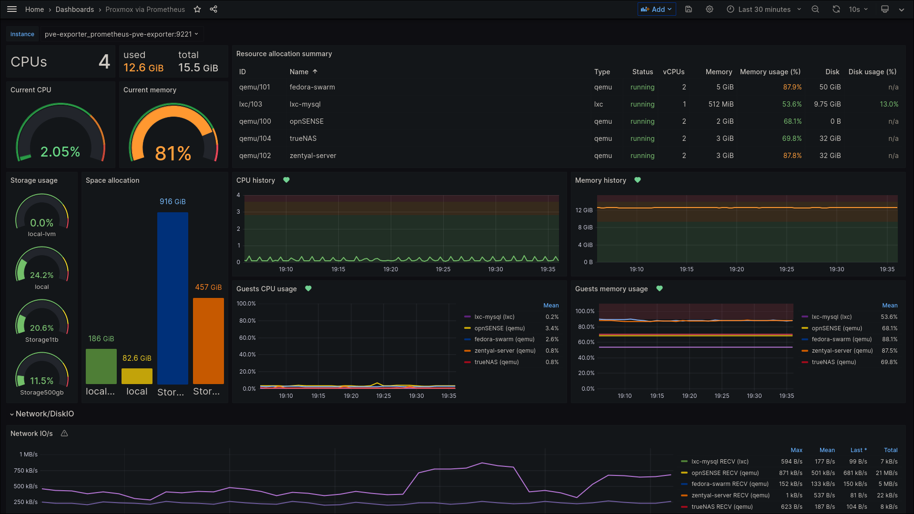
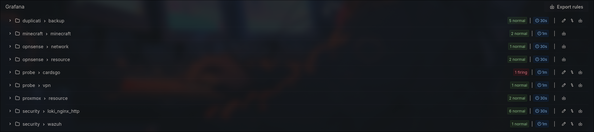

# Monitoring and Alerts

## Critical operation
There are some operation that can not stop, otherwise it will stop operation and production wokloads.

| Tecnology | Workload |
|--------|:-----------:|
| Host System (Proxmox) | This is where all systems are running |
| opnSENSE Virtual Machine | Control all the internet traffic |
| fedora-server Virtual machine | Where's running the primary dns server and Docker Swarm |
| Nginx | Nginx is exposed to internet so must have some monitoring and alerting due security stuff and **without nginx, none of swarm apps wil work**

## [Grafana Dashboards](../proxmox-vms/fedora-server/swarm/grafana/dashboards/)
- opnSENSE
- Adguard
- Proxmox
- Nginx
- Loki Swarm
- Docker Swarm
- Duplicati

## Monitoring system
The core of monitoring is Grafana, wich is running inside docker swarm. All the systems that need to be monitored, should deliver data to Grafana somehow.
- [Grafana](../proxmox-vms/fedora-server/swarm/grafana/)
- Docker Swarm logs is also in Grafana through Loki stack and datasource.

## Alerting
All alert should be deliver by Grafana to [whatsapp contact point that I made](https://github.com/AleixoLucas42/grafana_whatsapp_contact_point) using webhook.

| Alert | Threshold |
|--------|:-----------:|
| ~~Adguard resolver latency~~ | > 900ms |
| opnSENSE CPU | > 40% [1min] |
| opnSENSE RAM | > 80% [1min] |
| Nginx 4xx status | > 20 [5min] |
| Proxmox CPU | > 50% [1min] |
| Proxmox RAM | > 90% [1min] |
\** I'm doing a lot of alerts, won't write all of then here.

## DISASTER RECOVERY PLAN
- In desaster case, the backup is beeing done to an internal storage and google drive.