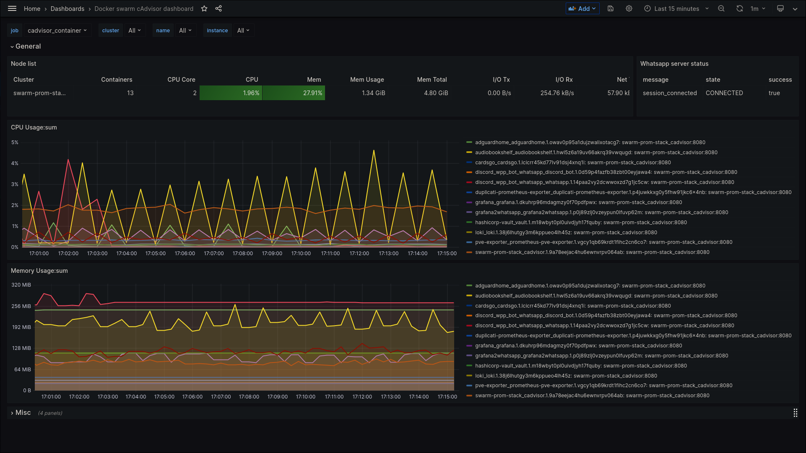

## Fedora Server ([Docker Swarm](https://docs.docker.com/engine/swarm/))
Docker Swarm is a container orchestration tool for clustering and scheduling Docker containers. With Swarm, IT administrators and developers can establish and manage a cluster of Docker nodes as a single virtual system. Docker Swarm lets developers join multiple physical or virtual machines into a cluster.

\* I'm running docker swarm because is lighter

## Server Specs
| KEY | VALUE |
|--------|:-----------:|
| CPU | 2vcpu |
| RAM | 6GB |
| SCSI DISK | 50GB |
| IP | 10.11.12.210 |
| NETWORK | net0, vmbr1 bridge |
| SYSTEM | Fedora Server 38 |
| AUTH | LDAP (zentyal) |

## Docker Swarm
- There are an worker running on oracle cloud; cluster sync is beeing done through zerotier VPN managed by opnSENSE.
- This oracle worker node is running an ubuntu server (aways free) and mainly runs nginx to provide an public ip to externalize anything that needs to be public.
- The master node is the fedora server machine.
- There's a internal network to deploy swarm stack apps.
- I'm using docker swarm volumes in most of apps instead using local disk.

## Docker swarm stack
You can find services configs on their folders.
- [ADGUARD](swarm/adguard/)
- [ADGUARD EXPORTER](swarm/adguard-exporter/)
- [AUDIOBOOKSHELF](swarm/audiobookshelf/)
- [CARDSGO](swarm/cardsgo/)
- [DISCORD WHATSAPP BOT](swarm/discord_whatsapp/)
- [DUPLICATI PROMETHEUS EXPORTER](swarm/duplicati-prom-exporter/)
- [GRAFANA](swarm/grafana/)
- [LOKI](swarm/loki/)
- [MINECRAFT SERVER](swarm/minecraft-server/)
- [JENKINS](swarm/jenkins/)
- [NGINX](swarm/nginx/)
- [PROXMOX PROMETHEUS EXPORTER](swarm/pve-exporter/)
- [SWARM PROMETHEUS STACK](swarm/swarm-prom-stack/)
- [HASHICORP VAULT](swarm/vault/)
- [NETBOOTXYZ](swarm/netbootxyz/)

## Virtual Machine Backup
- VM Backup is beeing done with proxmox backup.
  - There's a duplicati on proxmox to backup vms to Google Drive
## Duplicati Backup
- Notification via e-mail
- Retention: 10 Versions
- Schedule: Daily 01:00 AM
- Backup name: HASHICORP VAULT
- Destination: Google Drive Folder
- Source: [hashicorp_vault-backup](https://github.com/AleixoLucas42/hashicorp_vault-backup)
