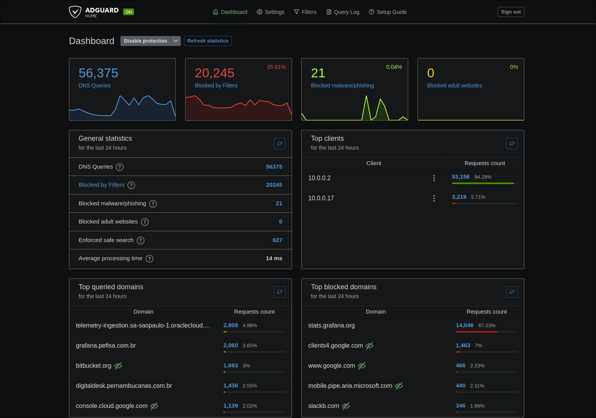

# ADGUARD HOME
Adguard is an DNS Server intented to block ads from internet, but i'm using as my main dns server on my network, doing dns rewrites and so on.

## Deploy Stack
> docker stack deploy -c docker-compose.yaml adguardhome