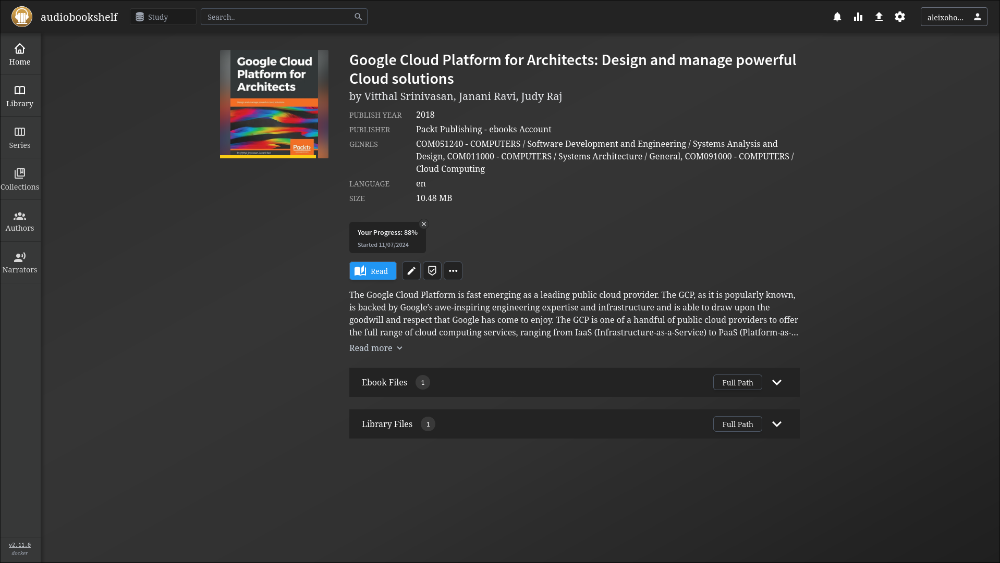

# AUDIOBOOKSHELF
Audiobookshelf is a self-hosted audiobook and podcast server. I'm using to store some books and PDF's that I want to read.

## Deploy Stack
> docker stack deploy -c docker-compose.yaml audiobookshelf

## REF
- [Github](https://github.com/advplyr/audiobookshelf)