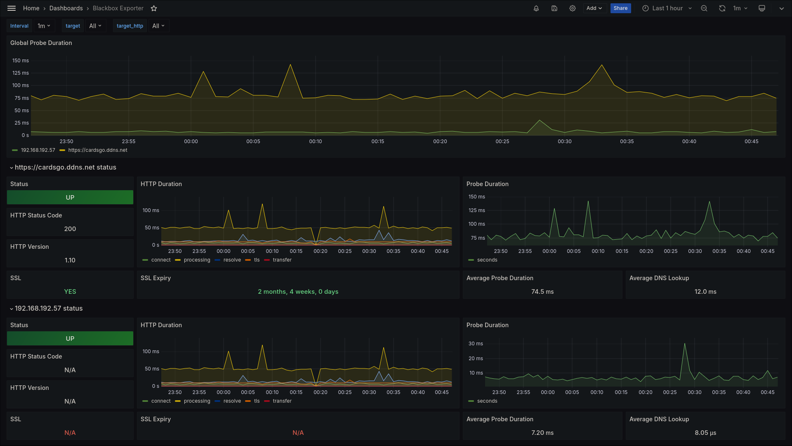

# BLACKBOX PROMETHEUS EXPORTER
The blackbox exporter allows blackbox probing of endpoints over HTTP, HTTPS, DNS, TCP, ICMP and gRPC.

## Deploy Stack
> docker stack deploy -c docker-compose.yaml blackbox-prom-exporter

## REF
- [Github](https://github.com/prometheus/blackbox_exporter)