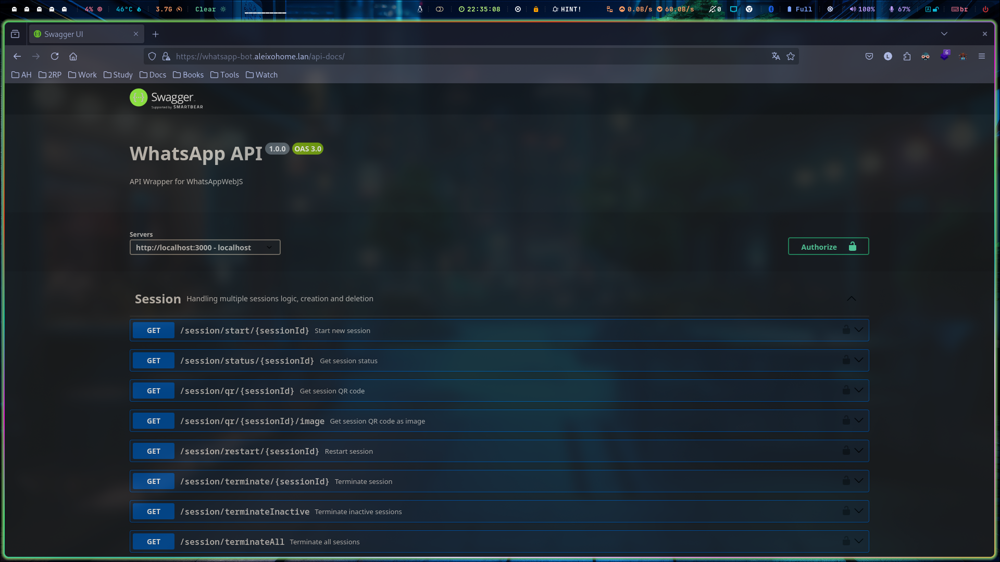

# DISCORD BOT
This Discord Bot is sending whatsapp alerts when someone get in any voice chat on my discord channel, mainly for gaming and friends stuff; there's also another service wich provide an swagger api to use like a whatsapp web but sending rest requests.

## Deploy Stack
> docker stack deploy -c docker-compose.yaml discord_wpp_bot_whatsapp

## REF
- [Discord BOT](https://github.com/AleixoLucas42/whatsapp_discord_bot)
- [Whatsapp Rest](https://github.com/chrishubert/whatsapp-web-api.git)