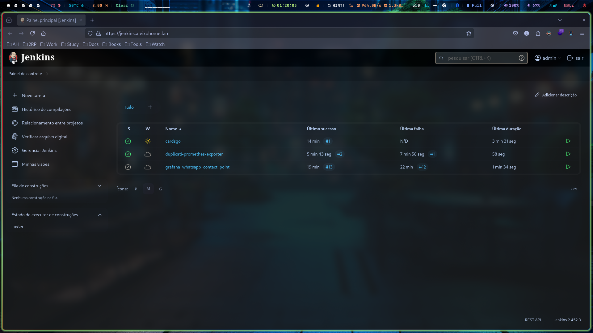

# JENKINS
Jenkins is an pipeline CI/CD tool that help us to deploy new features on environments, I'm using to update docker swarm services that I made.

## Deploy Stack
> docker stack deploy -c docker-compose.yaml jenkins
