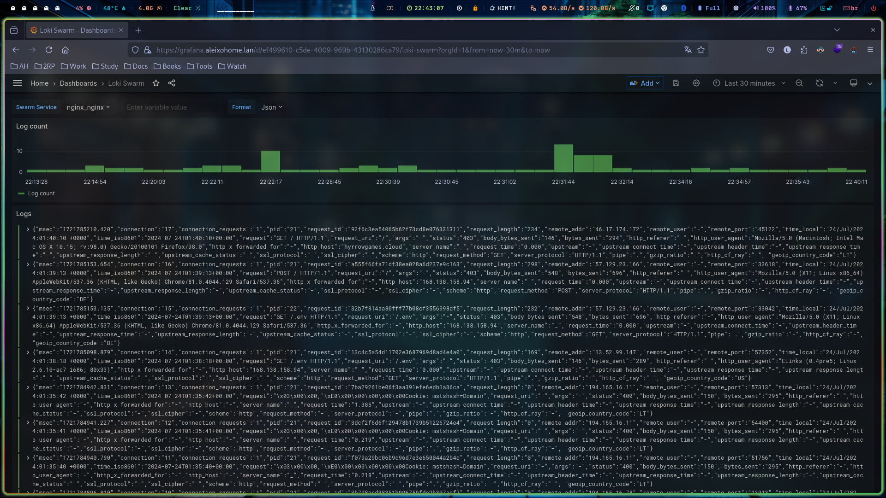

# GRAFANA LOKI
Loki is an log engine that works for a lot of systems, i'm collecting docker logs and monitoring throug Grafana. I also can make alerts based on logs in Grafana Loki.


## To do in all nodes

> docker plugin install grafana/loki-docker-driver:latest --alias loki --grant-all-permissions

- Edit /etc/docker/daemon.json
```json
{
  "metrics-addr" : "0.0.0.0:9323",
  "experimental" : true,
  "debug" : false,
  "log-driver": "loki",
  "log-opts": {
     "loki-url": "http://127.0.0.1:3100/loki/api/v1/push"
  }
}
```

> docker node ls

> docker node update --availability drain \<node-id> 

> systemctl restart docker

> docker node update --availability active \<node-id>

> docker stack deploy -c docker-compose-swarmstack.yml loki

## REF
- [Loki docker swarm](https://github.com/swarmstack/loki)