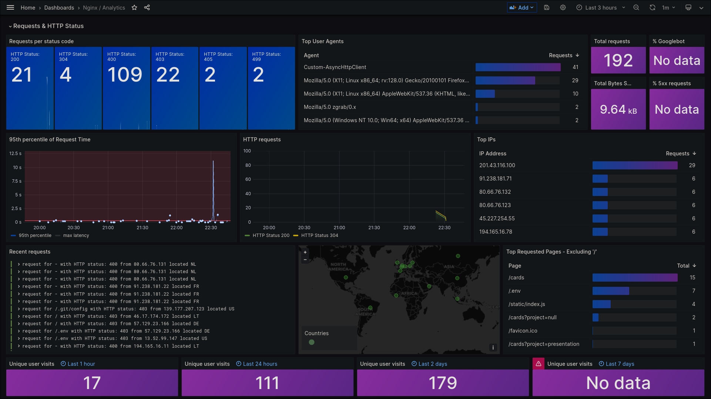

# NGINX
This nginx that receive requests for CardsGO (internet) and pass it to opnSENSE WAF (nginx). All other services are just internal and only CardsGO pass throug this nginx.

## Deploy Stack
> docker secret create nginx_main_conf nginx_main.conf

> docker secret create nginx_conf nginx.conf

> docker secret create aleixohome_crt aleixohome.crt

> docker secret create aleixohome_key aleixohome.key

> docker stack deploy -c docker-compose.yaml nginx

## REF
- https://www.miyuru.lk/geoiplegacy