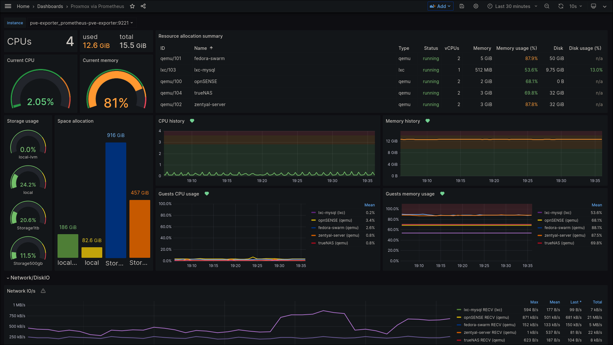

# PROXMOX PROMETHEUS EXPORTER
This is an exporter that exposes information gathered from Proxmox VE node for use by the Prometheus monitoring system.

## Deploy Stack

> docker stack deploy -c docker-compose.yaml pve-exporter

## REF
- [Github](https://github.com/prometheus-pve/prometheus-pve-exporter)