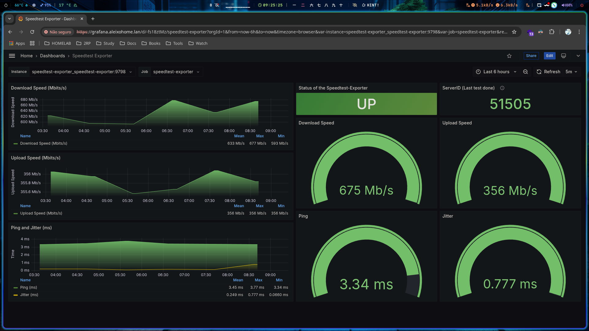

# SPEEDTEST EXPORTER
Speedtest exporter is a Prometheus exporter written in Python using the official Speedtest CLI made by Ookla.

## Deploy Stack

> docker stack deploy -c docker-compose.yaml speedtest-exporter

## REF
- [Github](https://github.com/MiguelNdeCarvalho/speedtest-exporter)

