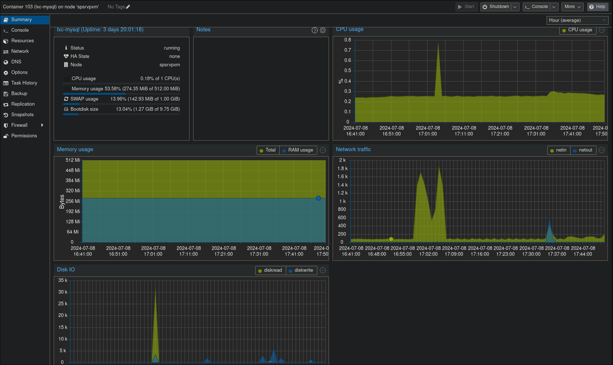

## MYSQL ([Debian LXC Container](https://pve.proxmox.com/wiki/Linux_Container))
MySQL, the most popular Open Source SQL database management system, is developed, distributed, and supported by Oracle Corporation. 

## Server Specs
| KEY | VALUE |
|--------|:-----------:|
| CPU | 1vcpu |
| RAM | 512mb |
| ROOT DISK | 10GB |
| IP | 10.11.12.248 |
| NETWORK | net0, vmbr1 bridge |
| SYSTEM | LXC Debian 12 |
| AUTH | Linux Pam |

## Virtual Machine Backup
- VM Backup is beeing done with proxmox backup.
  - There's a duplicati on proxmox to backup vms to Google Drive