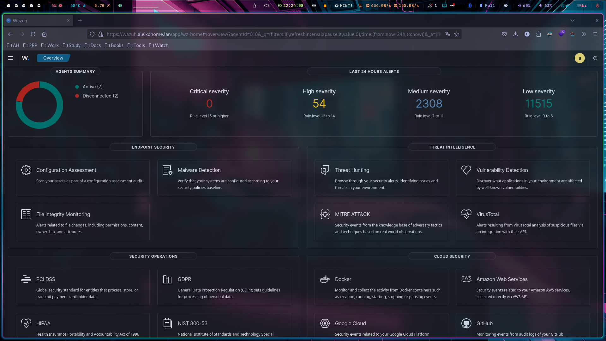

## WAZUH ([Ubuntu LXC Container](https://pve.proxmox.com/wiki/Linux_Container))
Wazuh is a free and open source security platform that unifies XDR and SIEM protection for endpoints and cloud workloads.

## Server Specs
| KEY | VALUE |
|--------|:-----------:|
| CPU | 4vcpu |
| RAM | 4GB |
| ROOT DISK | 20GB |
| IP | 10.11.12.246 |
| DNS | wazuh.aleixohome.lan |
| NETWORK | net0, vmbr1 bridge |
| SYSTEM | LXC Ubuntu 22.04 |
| AUTH | Linux Pam |

## CONFIG
What I have done so far because i'm still learning this tool.
- Configured agent on all machines
  - For windows I've used GPO
- Configured VirusTotal integration to remove threat
  - For windows I've used GPO to place the remove-threat.exe file
  - For linux I setted the remove-threat.py file manually in all machines
- Turned on CIS Benchmark
  - Slowly i'm lookin in 'configuration assessment' session and fixing some issues.
- Turned on vulnerability detection
  - I've tried fix some of linux CVE's

## Virtual Machine Backup
- VM Backup is beeing done with proxmox backup.
  - There's a duplicati on proxmox to backup vms to Google Drive
