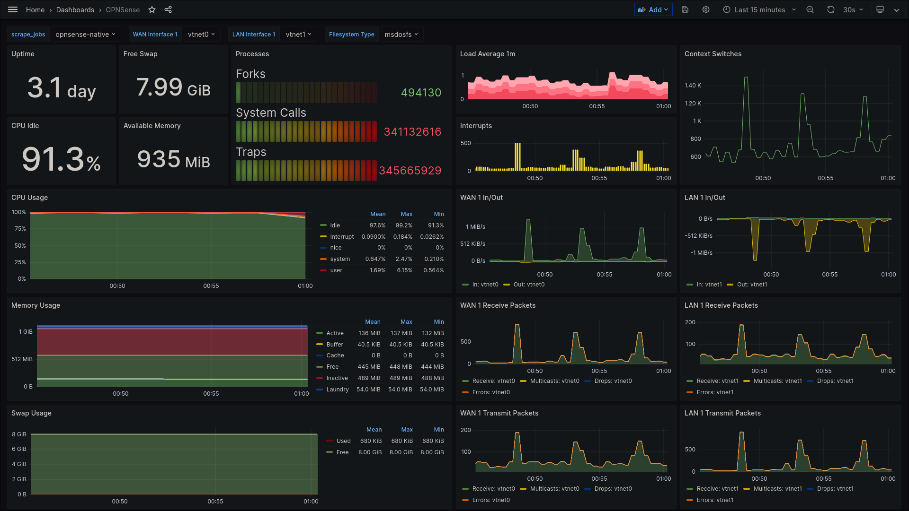

# OPNSENSE

OPNSense is a BSD-licensed firewall based on FreeBSD and developed by Decisio, a Dutch company that builds hardware and sells embedded OPNsense packages. It is a fork of pfSense, and this one is also a fork of m0n0wall, and all of these are based on FreeBSD. It was released in January 2015.

## General Info:
| kEY   |      VALUE      |
|----------|:-------------:|
| CPU | 2vcpu |
| RAM |    2GB   |
| IP | 10.11.12.254 |
| SCSI DISK | 32GB |
| Net Iface | x2 vtIO GBe |
| Auth | LDAP (zentyal) |
| WEB PORT | 8443 |

## Running
- ZeroTier
- DNS Unbound
- DD CLINET
- Suricata

## Virtual Machine Backup
- VM Backup is beeing done with proxmox backup.
  - There's a duplicati on proxmox to backup vms to Google Drive
## opnSENSE Backup
- There are configured opnSENSE backup to send configuration to Google Drive
- Backup count: 5