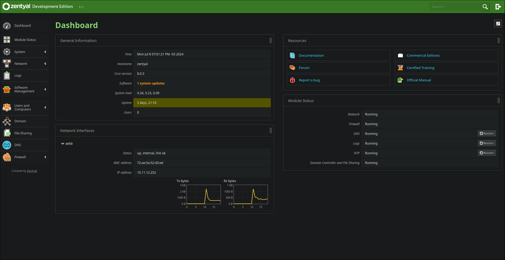

## [Zentyal 8](https://zentyal.com/)
Zentyal (previously known as eBox Platform) is a open source email and groupware solution based on Ubuntu Linux. The latest release (Zentyal Server 8.0 Development) took place on February 26, 2024. Zentyal implements the Microsoft Exchange Server protocols on top of standard open source components (such as Dovecot, Postfix, Samba, etc.) in order to provide native compatibility with Microsoft Outlook clients.

## Server Specs
| KEY | VALUE |
|--------|:-----------:|
| CPU | 2vcpu |
| RAM | 4GB |
| SCSI DISK | 32GB |
| IP | 10.11.12.252 |
| NETWORK | net0, vmbr1 bridge |
| SYSTEM | Zentyal 8 |
| WEB PORT | 8443 |
| AUTH | LDAP (zentyal) |

## Group Policies
I'm using windows as gamestation so all windows are under zentyal domain.
- Wallpaper
  - Changes wallpaper to all authenticated users
- fileshare
  - Map a smb drive that is provided by trueNAS
- Application
  - Install wazuh agent to authenticated users
- File
  - Custom hosts on authenticated users machine
  - Remove threat file for Wazuh
- security
  - Enforce BitLocker (Lot of configs)
  - Enforce remote desktop allow only to domain computers and same network level
  - Password policy (Lot of configs)
  - Account lock policy
  - Do not allow anonymous enumeration of accounts and shares
  - Do not store hash value of LAN Manager on next password change
  - Deactivate guest user (and others local users)
  - Inactivity limit
  - Interactive logon policy (There's a message that says "The computer is beeing audited... hehe")
  - Firewall allow 3389 only to domain level
  - Remove any users from local administrators group
  - There's more...

## Virtual Machine Backup
- VM Backup is beeing done with proxmox backup.
  - There's a Duplicati on proxmox to backup vms to Google Drive
## Zentyal Backup
- Configured a Duplicat backup with run-script-before-required (`/usr/share/zentyal/make-backup`) and run-script-after
  - So it generate a backup from internal zentyal script, Duplicati send to Google Drive and finally remove the backup file from filesystem.
  - the backup was configured with 15 days retention.