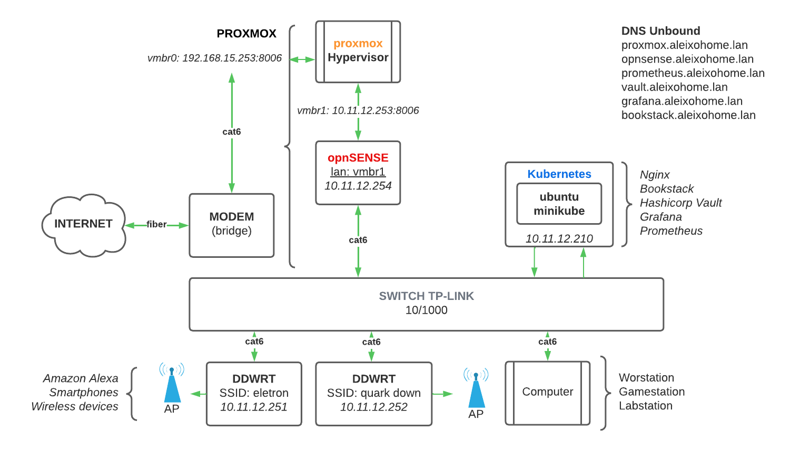

# ALEIXOHOME LAB

Hello everyone, this is my small homelab, I made the server from a computer that my friend gave me.

## Topology

\* I'm running docker swarm because is lighter

## Server Specs
| KEY | VALUE |
|--------|:-----------:|
| Processor | Intel(R) Core(TM) i5-7600 |
| Brand | Custom |
| Storage 1 | 1TB |
| Storage 2 | 500GB |
| Storage 3 | 500GB |
| IP | 10.11.12.253 |
| CPU | 4vcpu |
| RAM | 16GB |
| Net Iface | x2 Gbe |
| SYSTEM | proxmox |

## Systems/apps running
### Virtual machines / LXC Container
- [DOCKER SWARM](proxmox-vms/fedora-server/)
- [TRUENAS](proxmox-vms/trueNAS/)
- [ZENTYAL 8](proxmox-vms/zentyal-server/)
- [LXC - MYSQL](proxmox-vms/lxc-mysql/)
- [OPNSENSE](proxmox-vms/opnsense/)
### Docker swarm stack
- [ADGUARD](proxmox-vms/fedora-server/swarm/adguard/)
- [AUDIOBOOKSHELF](proxmox-vms/fedora-server/swarm/audiobookshelf/)
- [CARDSGO](proxmox-vms/fedora-server/swarm/cardsgo/)
- [DISCORD WHATSAPP BOT](proxmox-vms/fedora-server/swarm/discord_whatsapp/)
- [DUPLICATI PROMETHEUS EXPORTER](proxmox-vms/fedora-server/swarm/duplicati-prom-exporter/)
- [GRAFANA](proxmox-vms/fedora-server/swarm/grafana/)
- [LOKI](proxmox-vms/fedora-server/swarm/loki/)
- [NGINX](proxmox-vms/fedora-server/swarm/nginx/)
- [PROXMOX PROMETHEUS EXPORTER](proxmox-vms/fedora-server/swarm/pve-exporter/)
- [SWARM PROMETHEUS STACK](proxmox-vms/fedora-server/swarm/swarm-prom-stack/)
- [HASHICORP VAULT](proxmox-vms/fedora-server/swarm/vault/)

## Monitoring
- [Monitoring and alerts](Monitoring/)

## Backup
- Retention: Keep monthly 1
- Schedule: Monthly 1st 00:00
- Node: All
- Destination: /mnt/storage1tb/dump
- *there are a duplicati app sending the backups to google drive

## Duplicati config
- Retention: 1
- Schedule: Monthly 2'st 00:00
- Backup name: PROXMOX_ALEIXOHOME
- Destination: Google Drive Folder
- Source: /mnt/storage1tb/dump

## Important things
- Configured bios password
- Configured chassis tampering alert
- Frontal USB disabled
- Back USB data blocker
- Server powered on fulltime and energy bill usage get up 9%
- I still need to buy a UPS

## Userfull Links
- [Proxmox setup](https://www.proxmox.com/en/proxmox-ve/get-started)
- [Proxmox Docs](https://www.proxmox.com/en/downloads/category/documentation-pve)
- [Proxmox training](https://www.proxmox.com/en/training)