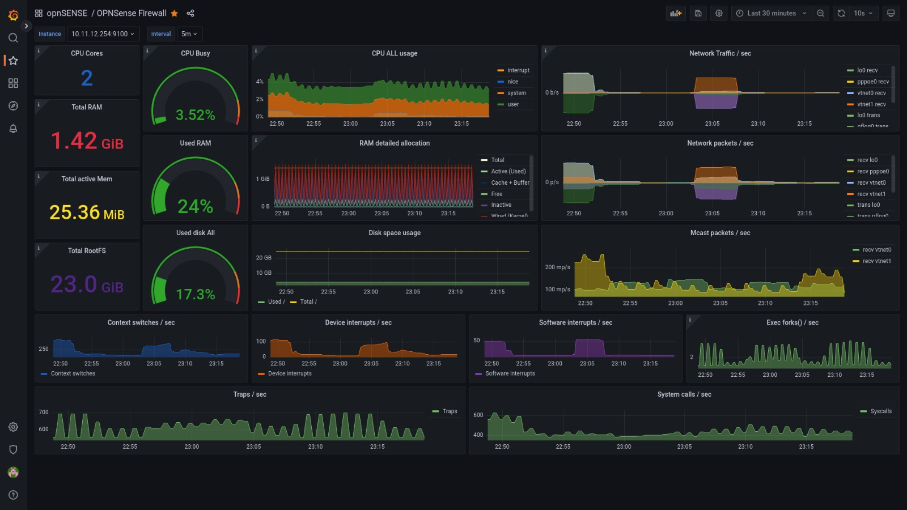

# OPNSENSE

OPNSense is a BSD-licensed firewall based on FreeBSD and developed by Decisio, a Dutch company that builds hardware and sells embedded OPNsense packages. It is a fork of pfSense, and this one is also a fork of m0n0wall, and all of these are based on FreeBSD. It was released in January 2015.

## General Info:
| kEY   |      VALUE      |
|----------|:-------------:|
| CPU | 2vcpu |
| RAM |    2GB   |
| IP | 10.11.12.254 |
| Net Iface | x2 vtIO GBe |
| DNS | opnsense.aleixohome.lan |

## Running
- ZeroTier
- DNS Unbound
- DD CLINET