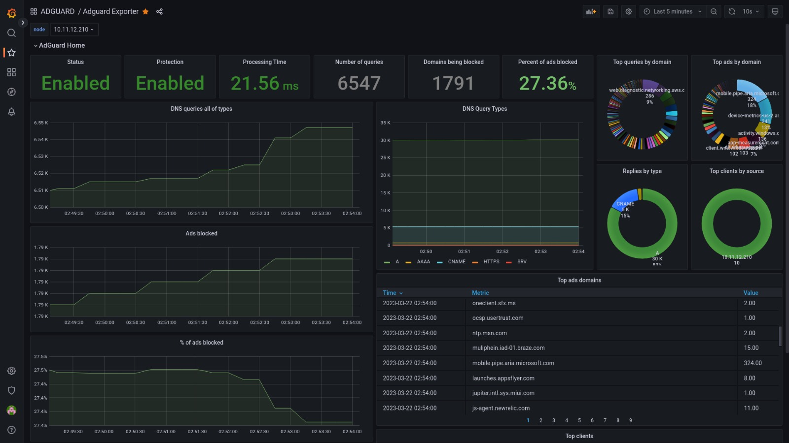

# Adguard prometheus exporter

[]()

## Setup
```
kubectl create ns adguard-exporter
kubectl create -f .
```

## Scrape example
```
- job_name: 'adguard-exporter'
  static_configs:
  - targets: ['adguard-exporter-svc.adguard-exporter.svc.cluster.local:9617']
```

# Usefull links
- [Github](https://github.com/ebrianne/adguard-exporter)