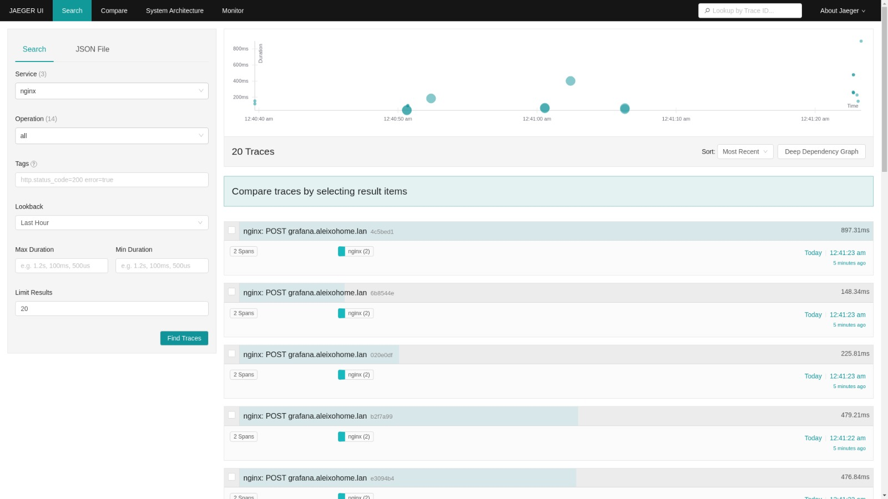

# Jaeger
Open source, end-to-end distributed tracing. Monitor and troubleshoot transactions in complex distributed systems

[]()

## Setup
- Pre-requisite Jeager is cert-manager
>kubectl apply -f https://github.com/cert-manager/cert-manager/releases/download/v1.9.0/cert-manager.yaml

- Add helm repo
>helm repo add jaeger-all-in-one https://raw.githubusercontent.com/hansehe/jaeger-all-in-one/master/helm/charts

- Create kubernetes namespace
>kubectl create ns jaeger

- Install using helm chart
>helm install jaeger-all-in-one jaeger-all-in-one/jaeger-all-in-one -n jaeger

- Edit nginx configmap
```
  data:
    enable-opentracing: "true"
    jaeger-collector-host: jaeger-all-in-one.jaeger.svc.cluster.local
    jaeger-sampler-param: "5"
    jaeger-sampler-type: ratelimiting
    opentracing-location-operation-name: $namespace $service_name #optional
    opentracing-operation-name: $request_method $host
```

- Anotate ingress to enable opentracing
```
kind: Ingress
metadata:
  annotations:
    nginx.ingress.kubernetes.io/enable-opentracing: "true"
```

# Useful links
- [Artifact Hub](https://artifacthub.io/packages/helm/jaeger-all-in-one/jaeger-all-in-one)
- [Nginx docs](https://kubernetes.github.io/ingress-nginx/user-guide/third-party-addons/opentracing/)