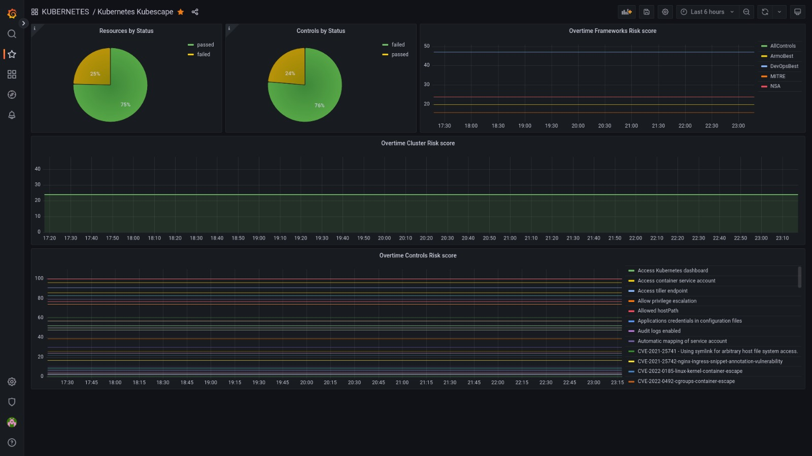

# Kubescape
Kubescape is an open-source Kubernetes security platform. It includes risk analysis, security compliance, and misconfiguration scanning
[]()
## Setup
```
curl -s https://raw.githubusercontent.com/kubescape/kubescape/master/install.sh | /bin/bash
```

## Framework chosen
- NSA
- ArmoBest

## Risc score maximum
- 15%

## Scan Command
```
kubescape scan --keep-local --include-namespaces=$(kubens -c) \
    framework nsa,armobest -v --enable-host-scan > $(kubens -c)_nsa-armobest.log
```
# Usefull links
- [Github](https://github.com/kubescape/kubescape)