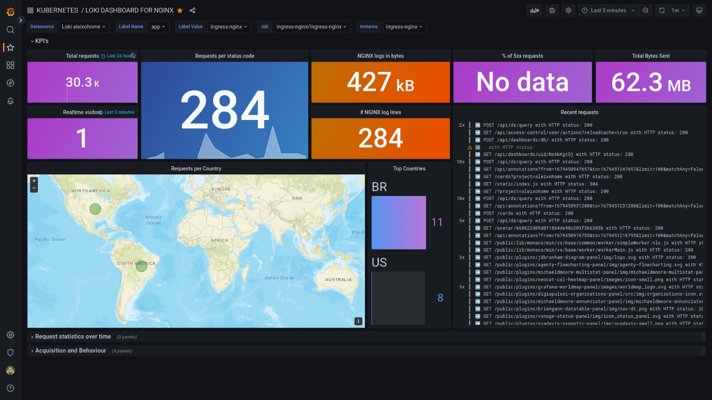

# LOKI
Loki is a horizontally-scalable, highly-available, multi-tenant log aggregation system inspired by Prometheus. It is designed to be very cost effective and easy to operate. It does not index the contents of the logs, but rather a set of labels for each log stream.
[]()
## Setup
```
kubectl create ns loki
helm repo add grafana https://grafana.github.io/helm-charts
helm repo update
helm -n loki upgrade --install loki grafana/loki-stack
```

## Grafana datasource

As the loki is in the same cluster as grafana, to create a loki datasource on grafana we just use a internal dns of kubernetes "\<svc-name\>.\<svc-namespace\>.svc.cluster.local:\<loki-port\>" in our case: `loki.loki.svc.cluster.local:3100`

## Edit nginx configmap
- kubectl edit configmap -n ingress-nginx ingress-nginx-controller
```
data:
  log-format-upstream: '{"msec":"$msec","connection":"$connection","connection_requests":"$connection_requests","pid":"$pid","request_id":"$request_id","request_length":"$request_length","remote_addr":"$remote_addr","remote_user":"$remote_user","remote_port":"$remote_port","time_local":"$time_local","time_iso8601":"$time_iso8601","request":"$request","request_uri":"$request_uri","args":"$args","status":"$status","body_bytes_sent":"$body_bytes_sent","bytes_sent":"$bytes_sent","http_referer":"$http_referer","http_user_agent":"$http_user_agent","http_x_forwarded_for":"$http_x_forwarded_for","http_host":"$http_host","server_name":"$server_name","request_time":"$request_time","upstream":"$upstream_addr","upstream_connect_time":"$upstream_connect_time","upstream_header_time":"$upstream_header_time","upstream_response_time":"$upstream_response_time","upstream_response_length":"$upstream_response_length","upstream_cache_status":"$upstream_cache_status","ssl_protocol":"$ssl_protocol","ssl_cipher":"$ssl_cipher","scheme":"$scheme","request_method":"$request_method","server_protocol":"$server_protocol","pipe":"$pipe","gzip_ratio":"$gzip_ratio","http_cf_ray":"$http_cf_ray","geoip_country_code":"$geoip_country_code", "request_body":"$request_body"}'
```


# Usefull links
- [First time I saw](https://github.com/isItObservable/Loki-Ngninx-Logql)
- [Github grafana loki](https://github.com/grafana/loki)
- [NGINX DOC REF](https://kubernetes.github.io/ingress-nginx/user-guide/nginx-configuration/configmap/#log-format-escape-json)
- [NGINX DASHBOARD REF](https://grafana.com/grafana/dashboards/12559-grafana-loki-dashboard-for-nginx-service-mesh/?pg=dashboards&plcmt=featured-main)
