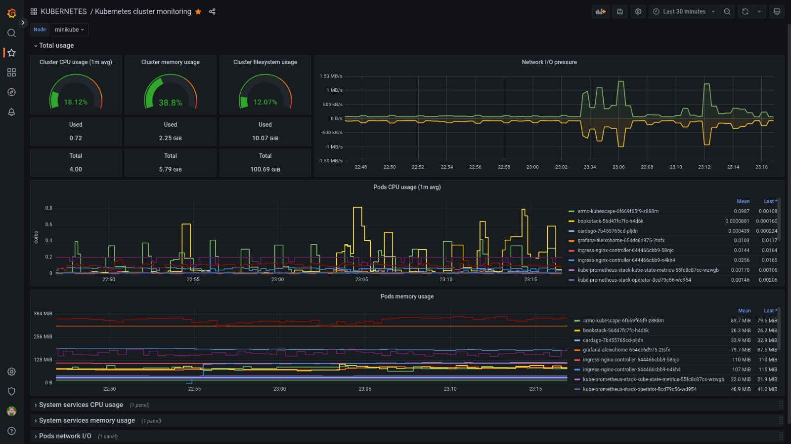

# ubuntu-minikube

This is a virtual machine that runs a kubernetes on minikube (because I have no resource to make a kubernetes cluster bare metal properly). There are another services running.
[]()
## General Info:
| kEY   |      VALUE      |
|----------|:-------------:|
| CPU | 4vcpu |
| RAM |    6GB   |
| IP | 10.11.12.210 |
| DNS | ubuntu-minikube.aleixohome.lan |
| ingress | minikube addons enable ingress |
| metrics-server | minikube addons enable metrics-server|
| CRONTAB | @reboot aleixohome /home/aleixohome/startup.sh |
| CRONTAB | @daily /home/aleixohome/vault-backup.sh |

## Important
- Has a cron startup that runs /home/aleixohome/startup.sh.
- startup.sh script start minikube and create a iptables forwarding from main network interface on port 80 to minikube interface
- I ran minikube addons enable ingress (create nginx controller automatically)
- I used deb package iptables-persistent to make iptables rule persistent
- I created ssh keys to connect
- There are a cronjob to dump data from hashicorp vault and store in /home/aleixohome
- Duplicati app is taking the dump file and backing up to google drive
- I'm using LOKI to stream kubernetes logs on grafana

# Created self-signed for Nginx ingress (k8s)
Stored on vault.
- Country name: BR
- State/Province: SP
- Locality name: SJC
- Org name: ALEIXOHOME
- Org unit name: HOMELAB
- Common name: *.aleixohome.lan
- E-mail: my-email@email.com
```
# Create cert
openssl req -newkey rsa:4096 \
            -x509 \
            -sha256 \
            -days 365 \
            -nodes \
            -out aleixohome.crt \
            -keyout aleixohome.key

# Create kubernetes Secret
kubectl -n $(kubens -c) create secret tls aleixohome-ssl \
    --key aleixohome.key \
    --cert aleixohome.crt
```

## Running
- Minikube
- Nginx ingress controller (k8s)
- Grafana (k8s)
- Hashicorp Vault (k8s)
- Prometheus (k8s)
- Mysql (k8s)
- Adguard exporter (k8s)
- Proxmox exporter (k8s)
- CardsGO (k8s)
- Kubescape (k8s)
- Bookstack (k8s)
- Loki (k8s)
- Adguard
- Duplicati